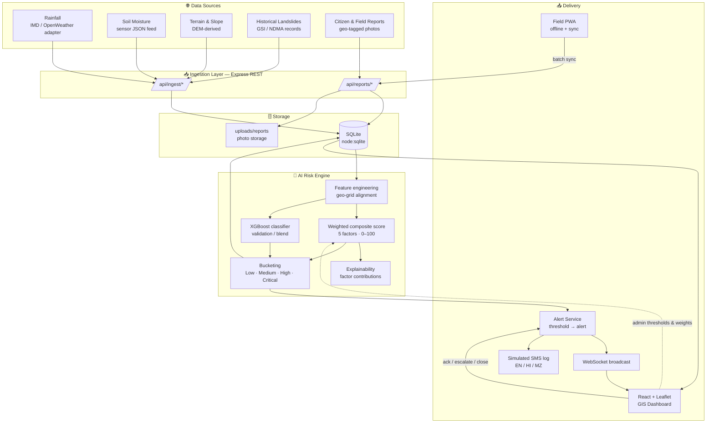

<div align="center">


### 🌧️ Hyper-Local Landslide & Flash Flood Early Warning System for India's Hilly Regions

**From Signals to Warnings. From Warnings to Action.**

<p align="center">
  
  
  
  
  
</p>

<p align="center">
  
  
  
  
  
  
  
  
</p>

<p align="center">
  <a href="https://youtu.be/bZ-st7Up_0Q">
    
  </a>
</p>

<p align="center">
  <b>Sense</b> → <b>Fuse</b> → <b>Predict</b> → <b>Alert</b> → <b>Respond</b> → <b>Learn</b>
</p>

</div>

---

## 🎬 Demo Video

<div align="center">

[](https://youtu.be/bZ-st7Up_0Q)

**▶ [Click to watch the full end-to-end demo on YouTube](https://youtu.be/bZ-st7Up_0Q)**

</div>

> **What the demo shows:** live GIS risk map for the Sikkim pilot → simulated monsoon rainfall spike → risk scores recompute → multilingual alerts fire over WebSocket → officer acknowledges/escalates → citizen files an offline geo-tagged report that syncs and appears as a pin on the map.

---

## 🪪 Submission Details

| | |
|---|---|
| **Hackathon** | Smart India Hackathon (SIH) 2026 |
| **Problem Statement ID** | **SIH26192** |
| **Problem Statement** | Flash Flood Prediction System for Hilly Regions using Multi-Source Data |
| **Organization** | Ministry of Home Affairs |
| **Theme / Category** | Disaster Management / Software |
| **Team Name** | Bharat Innovatorz |
| **Team ID** | 143674 |
| **Project Name** | **DHARA AI** — *Dynamic Hazard Assessment & Risk Alerts* |
| **Pilot Area** | Sikkim (East & West districts) — architecture generalises to any hilly state |
| **Demo Video** | [youtu.be/bZ-st7Up_0Q](https://youtu.be/bZ-st7Up_0Q) |

---

## 📋 Table of Contents

<details>
<summary>Click to expand</summary>

- [🔥 The Problem](#-the-problem)
- [💡 Our Solution](#-our-solution)
- [✅ PS 26192 Requirement Coverage](#-ps-26192-requirement-coverage)
- [✨ Key Features](#-key-features)
- [🖼️ Screenshots](#️-screenshots)
- [🏗️ System Architecture](#️-system-architecture)
- [🤖 AI Risk Engine](#-ai-risk-engine)
- [🌐 Multi-Source Data Fusion](#-multi-source-data-fusion)
- [🚨 Alerting System](#-alerting-system)
- [📱 Offline-First Field Reporting PWA](#-offline-first-field-reporting-pwa)
- [🛠️ Tech Stack](#️-tech-stack)
- [📁 Repository Structure](#-repository-structure)
- [🔌 API Reference](#-api-reference)
- [⚡ Getting Started](#-getting-started)
- [🎮 Demo Walkthrough](#-demo-walkthrough)
- [🧪 Model Training & Evaluation](#-model-training--evaluation)
- [🚧 Honest Scope — What's Real vs. Simulated](#-honest-scope--whats-real-vs-simulated)
- [🗺️ Roadmap](#️-roadmap)
- [🌍 Impact & Feasibility](#-impact--feasibility)
- [📚 Research & References](#-research--references)
- [👥 Team Bharat Innovatorz](#-team-bharat-innovatorz)
- [📄 License](#-license)

</details>

---

## 🔥 The Problem

<table>
<tr>
<td width="50%">

### Hilly India is exposed — and warned too late

Hilly states, including the entire North Eastern Region, suffer recurring **landslides, flash floods, road blockages and slope failures**, driven by intense monsoon rainfall, steep terrain, fragile geology, and unplanned hill cutting. Events strike with **very short warning times**.

- **Reactive, not predictive** — incidents are usually reported *after* the damage.
- **Coarse resolution** — warnings issue at district/region level, but evacuation decisions are made at **village and ward level**.
- **Fragmented data** — rainfall, soil, terrain, satellite and historical records live in separate silos.
- **Last-mile gap** — remote villages with poor connectivity get alerts late, or never.

</td>
<td width="50%">

### The core problem

> *"Authorities and communities lack a real-time, predictive, hyper-local early-warning system — one that fuses rainfall, soil moisture, slope stability, historical inventories and IoT/field inputs, and still works in low-connectivity remote areas — to provide sufficient lead time for evacuation."*

**Who is affected**

| Stakeholder | Need |
|---|---|
| District Disaster Mgmt Authorities | Prioritised, actionable risk data |
| SDMA / NDMA / MDoNER | Regional oversight & reporting |
| Villagers | Timely alerts in local language |
| PWD / BRO / police / revenue staff | Instant ground-condition reporting |
| Emergency responders | Road & connectivity status for routing |

</td>
</tr>
</table>

---

## 💡 Our Solution

**DHARA AI** is an end-to-end early-warning platform that turns raw multi-source signals into **village/ward-level risk scores, real-time alerts, and prioritised response plans** — and closes the loop with ground truth from citizens and field officers.

```
   SENSE                  PREDICT                 ALERT                  RESPOND
┌───────────┐         ┌──────────────┐       ┌──────────────┐       ┌──────────────┐
│ Rainfall  │         │  Composite   │       │  Threshold   │       │  P1/P2/P3    │
│ Soil      │  fuse   │  risk score  │ ────▶ │  breach →    │ ────▶ │  response    │
│ Terrain   │ ──────▶ │  (0–100) per │       │  multilingual│       │  priority    │
│ History   │         │  village grid│       │  alert (WS + │       │  list, roads │
│ Citizens  │         │  + explain   │       │  SMS log)    │       │  & villages  │
└───────────┘         └──────────────┘       └──────────────┘       └──────────────┘
      ▲                                                                    │
      └──────────── Continuous feedback loop: field reports & outcomes ◀───┘
```

### What makes DHARA AI different

| | |
|---|---|
| 🎯 **Hyper-local** | Risk computed on grid cells sized to village/ward boundaries — not just district level |
| 🔍 **Explainable** | Every score shows *which factors drove it* (rainfall, soil, slope, history, citizen signal) |
| 📡 **Works offline** | PWA queues geo-tagged photo reports in IndexedDB and syncs when the network returns |
| 🌐 **Multilingual** | Alert templates in English, Hindi and Mizo (text externalised for easy expansion) |
| 🧑‍🤝‍🧑 **Human-in-the-loop** | Authorities acknowledge / escalate / close alerts — reducing alert fatigue |
| 🔁 **Bridges AI with ground reality** | Citizen reports feed back into the risk score as a live signal |

---

## ✅ PS 26192 Requirement Coverage

| # | PS 26192 Requirement | How DHARA AI Addresses It | Status |
|---|---|---|:---:|
| 1 | Rainfall data integration | Hourly rainfall ingestion + 48h forecast projection; live IMD/OpenWeather adapter path | ✅ |
| 2 | Soil-moisture sensors | Sensor JSON feed ingestion (simulated; hardware-ready schema) | ✅ |
| 3 | Slope-stability models | DEM-derived slope angle per grid cell as a weighted risk factor | ✅ |
| 4 | Historical landslide / flood inventories | GSI/NDMA-style incident records → incident-density factor + map overlay | ✅ |
| 5 | Real-time IoT inputs | Sensor ingest API + geo-tagged citizen/field reports as a real-time signal | ✅ |
| 6 | **Hyper-local (village/ward) forecasts** | Grid-cell scoring sized to village/ward boundaries; per-zone click-through | ✅ |
| 7 | Lead time for evacuation | Forecast view (24–48h) + threshold alerts + lead-time-to-event demo | ✅ |
| 8 | AI/ML risk identification & prediction | Explainable weighted composite model + XGBoost classifier | ✅ |
| 9 | Real-time alerts to authorities & communities | WebSocket broadcast + simulated SMS log; Twilio-ready dispatch | ✅ |
| 10 | GIS map visualisation | Leaflet heatmap + zones, roads, villages, alerts and report pins | ✅ |
| 11 | Geo-tagged photo/video uploads by citizens & field officers | Offline-capable PWA with GPS capture | ✅ |
| 12 | Dashboard: severity, roads, weather forecast, response prioritisation | Summary panel, road/village layers, forecast tab, P1/P2/P3 response tab | ✅ |
| 13 | Multilingual notifications | English / Hindi / Mizo templates | ✅ |
| 14 | Low-network / offline functionality | Service Worker + IndexedDB queue + auto-sync; SMS fallback channel | ✅ |

---

## ✨ Key Features

| Feature | Description | Component |
|---|---|---|
| 🗺️ **GIS Risk Heatmap** | Colour-coded risk circles + heatmap overlay (🟢 Low · 🟡 Medium · 🟠 High · 🔴 Critical), zoomable to village level | `RiskMap.jsx` |
| 🧭 **Layer Toggles** | Rainfall, risk zones, road network (NH-10, NH-310, NH-510, SH-3), villages, active alerts, citizen reports | `RiskMap.jsx` |
| 🔬 **Zone Inspector** | Score gauge, factor-contribution bars, latest sensor readings, risk-history chart, multilingual alert text | `ZonePanel.jsx` |
| 🧮 **Explainable Risk Engine** | 5-factor weighted composite (0–100) with per-factor explainability | `riskEngine.js` |
| 🤖 **XGBoost Classifier** | Trained on historical-incident features; blended/compared with the rule-based score | `models/`, `results/` |
| 🌧️ **48h Forecast View** | Hourly rainfall bars with risk-coloured projection per district | `Sidebar.jsx` |
| 🚑 **Emergency Prioritisation** | P1/P2/P3 ranked zones with recommended actions (risk × exposure) | `/api/risk/prioritization` |
| 🔔 **Real-Time Alerts** | WebSocket broadcast, toast notifications, simulated SMS log | `alertService.js` |
| ✅ **Alert Lifecycle** | Acknowledge → Escalate (to State EOC / NDMA) → Close | `alerts.js` |
| 📱 **Field Reporting PWA** | Geo-tagged photo reports, offline queue, auto-sync, live status tracking | `pwa/index.html` |
| ⚙️ **Admin Console** | Tune risk thresholds & 5 model weights, view roles, monitor data-source health | `AdminPanel.jsx` |
| 🌐 **Multilingual UI** | EN / हि / MZ switcher in the header | `Header.jsx` |

---

## 🖼️ Screenshots

> 📌 **Setup note:** save each screenshot into `docs/screenshots/` using the file names below and the images will render automatically.

### 🏠 1. GIS Command Dashboard — Risk Heatmap
Village-level risk circles and heatmap overlay across the Sikkim pilot, with the summary panel (critical zones, high-risk zones, active alerts, 24h field reports).


---

### 🧭 2. Map Layers — Roads, Villages & Report Pins
Toggle road corridors (NH-10 / NH-310 / NH-510 / SH-3), village settlements, active alerts and purple citizen-report pins.

<table>
<tr>
<td width="50%"></td>
<td width="50%"></td>
</tr>
<tr>
<td align="center"><i>Road network overlay</i></td>
<td align="center"><i>Villages & geo-tagged citizen reports</i></td>
</tr>
</table>

---

### 🔬 4. Zone Inspector — Explainable Risk
Click any zone to see the composite score gauge, contributing-factor bars (rainfall, soil, slope, history, citizen signal), sensor readings and risk history.


---

### ⚡ 5. Rainfall-Spike Simulation → Live Alerts
One click on **"Simulate Rainfall Spike"** recomputes scores, escalates zones to Orange/Red, and fires alerts in real time over WebSocket.

<table>
<tr>
<td width="50%"></td>
<td width="50%"></td>
</tr>
<tr>
<td align="center"><i>Before: baseline risk</i></td>
<td align="center"><i>After: critical zones + live alerts</i></td>
</tr>
</table>

---

### 🚨 6. Alert Management & Multilingual Messages
Acknowledge / Escalate / Close controls, plus English / Hindi / Mizo alert text.

<table>
<tr>
<td width="50%"></td>
<td width="50%"></td>
</tr>
</table>

---

### 🌧️ 7. Forecast & Emergency Response Prioritisation

<table>
<tr>
<td width="50%"></td>
<td width="50%"></td>
</tr>
<tr>
<td align="center"><i>48h hourly rainfall & risk projection</i></td>
<td align="center"><i>P1 / P2 / P3 response list</i></td>
</tr>
</table>

---

### 📱 8. Field Reporting PWA — Offline-First

<table>
<tr>
<td width="33%"></td>
<td width="33%"></td>
<td width="33%"></td>
</tr>
<tr>
<td align="center"><i>Geo-tagged photo report</i></td>
<td align="center"><i>Offline queue (IndexedDB)</i></td>
<td align="center"><i>Received → Under Review → Verified</i></td>
</tr>
</table>

---

### ⚙️ 9. Admin Console — Thresholds, Weights & System Health

<table>
<tr>
<td width="50%"></td>
<td width="50%"></td>
</tr>
</table>

---

### 📊 10. Model Results (XGBoost)

<table>
<tr>
<td width="50%"></td>
<td width="50%"></td>
</tr>
<tr>
<td align="center"><i>Confusion matrix</i></td>
<td align="center"><i>Feature importance</i></td>
</tr>
</table>

---

## 🏗️ System Architecture



### Runtime flow

1. **Cron scheduler** refreshes data → **risk engine recomputes** every grid cell.
2. Cells crossing the configured threshold generate an **alert** (location, level, recommended action, timestamp).
3. Alert is **broadcast via WebSocket** to every open dashboard and written to the **SMS log** in EN/HI/MZ.
4. Officer **acknowledges / escalates / closes** — status changes broadcast back to all clients.
5. Field reports (online or synced later) raise the **citizen-signal factor**, tightening the next recompute.

### Design principles

- **Modular, cloud-native, open-API** — every layer is a swappable service (rainfall adapter, alert channel, model).
- **Transparent over opaque** — an auditable weighted score is the primary output; ML validates and blends rather than replaces it.
- **Offline-first at the edge** — the last mile is the hardest; the PWA and SMS channel are first-class citizens.
- **Single source of truth for geography** — roads and villages served from one `geo_features.json` via API.

---

## 🤖 AI Risk Engine

### Composite score

```
RiskScore = w1·RainfallIntensity
          + w2·SoilSaturationProxy
          + w3·SlopeAngle
          + w4·HistoricalIncidentDensity
          + w5·RecentCitizenReportSignal
```

Each factor is normalised to **0–1**; the weighted sum is scaled to **0–100** and bucketed.

| Factor | Default Weight | Data source |
|---|:---:|---|
| 🌧️ Rainfall intensity | 0.35 | Weather API / simulated feed |
| 💧 Soil moisture (saturation proxy) | 0.25 | Sensor feed (simulated → IoT) |
| ⛰️ Slope angle | 0.20 | DEM (SRTM / Bhuvan) |
| 📜 Historical incident density | 0.12 | GSI / NDMA inventory |
| 📸 Citizen report signal | 0.08 | Geo-tagged PWA reports |

> All weights are **tunable live from the Admin Panel** and take effect on the next recompute.

### Risk classes

| Class | Score | Colour | Meaning |
|---|:---:|:---:|---|
| Low | < 30 | 🟢 | Routine monitoring |
| Medium | ≥ 30 | 🟡 | Watch — pre-position resources |
| High | ≥ 55 | 🟠 | Advisory — restrict vulnerable roads |
| Critical | ≥ 75 | 🔴 | Alert — evacuation-level response |

*(Thresholds are admin-configurable per region.)*

### Why weighted-composite **and** ML?

| Approach | Role in DHARA AI |
|---|---|
| **Weighted composite** | Primary, explainable, fast to recompute, easy for officers to trust and tune |
| **XGBoost classifier** | Trained on historical-incident features; used to validate and calibrate the rule-based score and to expose feature importance |
| **Explainability (FR2.5)** | Per-zone factor-contribution bars show *why* a zone is Orange or Red — critical for human-in-the-loop trust |

### Hazard coverage

Rainfall intensity and soil saturation are the shared triggers behind both **shallow landslides** and **flash floods** in steep catchments. DHARA AI scores both hazards from the same fused feature set and surfaces the driving factors so authorities can tell a slope-failure-dominated zone from a rainfall-runoff-dominated one.

---

## 🌐 Multi-Source Data Fusion

| Data type | Prototype (this repo) | Production path |
|---|---|---|
| **Rainfall** | Simulated hourly feed + 48h forecast; OpenWeather/IMD adapter interface | Direct IMD data feed; gauge & radar integration |
| **Soil moisture** | Simulated sensor JSON with realistic ranges | Physical IoT soil-moisture probes |
| **Terrain / slope** | DEM-derived slope per grid cell (Sikkim) | High-resolution DEM / LiDAR |
| **Historical landslides** | GSI/NDMA-style incident records (`historical_landslides.json`) | Continuously updated verified inventory (Bhuvan Landslide Atlas, GSI) |
| **Satellite** | Out of prototype scope | Sentinel-2 overlays; InSAR deformation |
| **Citizen / field reports** | Live PWA reports (real) | Same, plus officer verification workflow |

**Pipeline:** collect → validate & clean → align spatial + temporal layers → unified **geo-grid dataset** → feature engineering → scoring.

---

## 🚨 Alerting System

| Capability | Detail |
|---|---|
| **Trigger** | Automatic when a zone's score crosses the configured threshold |
| **Content** | Location, risk level, recommended action, timestamp |
| **Channels** | In-app (WebSocket + toast) · SMS (simulated log; Twilio-ready) |
| **Languages** | 🇬🇧 English · 🇮🇳 Hindi · Mizo |
| **Lifecycle** | Active → Acknowledged → Escalated (State EOC / NDMA) → Closed |
| **Audit** | All predictions and alert state changes are logged |

**Sample citizen alert (EN):**
> ⚠️ *High landslide/flash-flood risk near [village]. Avoid [road] until further notice. Move to higher ground if water rises.*

---

## 📱 Offline-First Field Reporting PWA

Built for the reality of remote hills: **patchy or zero connectivity**.

```
Citizen / Field officer
        │  capture GPS + photo + hazard type + note
        ▼
   Online? ── yes ──▶ POST /api/reports ───────────────┐
        │                                              │
        no                                             ▼
        ▼                                     Pin on dashboard map
  IndexedDB queue (photo → Base64)                     ▲
        │  connectivity returns                        │
        └──▶ auto-sync ──▶ POST /api/reports/sync-batch┘
                              │
                              ▼
        Status tracking: Received → Under Review → Verified
```

| Feature | Implementation |
|---|---|
| Installable | Service Worker (`sw.js`) + manifest icons (192/512) |
| Offline photos | Serialised to Base64 in IndexedDB, rebuilt into a Blob on sync |
| Geo-tagging | One-tap GPS capture, manual entry fallback |
| Transparency | Submitter sees server-side review status |
| Feedback loop | Reports feed the citizen-signal factor of the risk score |

---

## 🛠️ Tech Stack

| Layer | Technology | Why |
|---|---|---|
| **Frontend** | React + Vite | Fast, component-based GIS dashboard |
| **Mapping / GIS** | Leaflet.js (+ heat layer), OpenStreetMap tiles | Lightweight, works on low bandwidth |
| **Backend API** | Node.js + Express | Simple REST + WebSocket in one runtime |
| **Real-time** | WebSocket (`ws`) | Instant alert broadcast to all clients |
| **Scheduler** | Cron in `server.js` | Periodic ingest & risk recompute |
| **Database** | SQLite (`node:sqlite`, built-in) | Zero-ops prototype; schema is PostGIS-ready |
| **ML / AI** | Python — scikit-learn, XGBoost | Tabular risk classification, feature importance |
| **Field App** | PWA — Service Worker + IndexedDB | Offline queue + installability |
| **Alerts** | Simulated SMS log (Twilio-ready), WebSocket | Multi-channel dispatch |
| **Storage** | Local `uploads/reports` (S3-compatible in production) | Geo-tagged photo evidence |

> **Production roadmap stack:** PostgreSQL + PostGIS, Firebase Auth/FCM push, Twilio SMS, Sentinel/Bhuvan imagery, cloud object storage, Gemini-assisted advisory text.

---

## 📁 Repository Structure

```text
Disaster_management/
│
├── backend/                       # Node.js Express API
│   ├── server.js                  # Server + WebSocket + cron scheduler
│   ├── db/database.js             # SQLite (node:sqlite)
│   ├── services/
│   │   ├── riskEngine.js          # Weighted composite scoring (5 factors)
│   │   └── alertService.js        # Alert generation + SMS log
│   ├── routes/
│   │   ├── risk.js                # scores, summary, history, trigger, prioritisation
│   │   ├── alerts.js              # list, active, status update
│   │   ├── reports.js             # submit, batch-sync, status tracking
│   │   ├── admin.js               # config, users, health, districts
│   │   └── ingest.js              # sensors, historical, forecast
│   └── data/
│       ├── districts.json         # Sikkim pilot grid cells + metadata
│       ├── geo_features.json      # Roads & villages (single source of truth)
│       └── historical_landslides.json
│
├── frontend/                      # React + Vite GIS dashboard
│   └── src/
│       ├── App.jsx · api.js
│       ├── context/AppContext.jsx # Global state + WebSocket
│       └── components/            # Header, Sidebar, RiskMap, ZonePanel,
│                                  # BottomBar, AdminPanel, ToastContainer
│
├── pwa/                           # Offline-capable field-reporting PWA
│   └── index.html
│
├── models/                        # Trained XGBoost weights, thresholds, feature lists
├── results/                       # Model evaluation outputs & plots
├── uploads/reports/               # Citizen-submitted photo evidence
├── docs/screenshots/              # ← README image assets live here
│
├── PRD_AI_Landslide_FlashFlood_EarlyWarning_PSID26192.md   # Product Requirements Doc
├── requirements.txt               # Python (ML) dependencies
├── package.json · package-lock.json
├── task.md
└── README.md                      # ← you are here
```

---

## 🔌 API Reference

| Endpoint | Method | Description |
|---|:---:|---|
| `/api/health` | GET | System health |
| `/api/risk/scores` | GET | Latest risk score for every zone |
| `/api/risk/summary` | GET | Dashboard KPIs |
| `/api/risk/trigger` | POST | Trigger recompute (`{"spike": true}` simulates a rainfall spike) |
| `/api/risk/history/:gridId` | GET | Historical scores for a zone |
| `/api/risk/prioritization` | GET | P1/P2/P3 emergency response list |
| `/api/alerts` | GET | All alerts (`?status=Active`) |
| `/api/alerts/active` | GET | Active alerts only |
| `/api/alerts/:id/status` | PATCH | Acknowledge / Escalate / Close |
| `/api/reports` | GET / POST | List reports / submit a report (photo upload) |
| `/api/reports/:id` | GET | Single report + review status |
| `/api/reports/sync-batch` | POST | Sync offline-queued reports |
| `/api/admin/config` | GET / PATCH | Risk thresholds & model weights |
| `/api/admin/users` | GET | User roles |
| `/api/admin/health` | GET | Data-source health + system stats |
| `/api/admin/districts` | GET | Pilot district metadata |
| `/api/admin/geo-features` | GET | Roads & villages |
| `/api/ingest/sensor-readings` | GET | Recent sensor data |
| `/api/ingest/historical-landslides` | GET | Historical incident records |
| `/api/ingest/forecast` | GET | 48h rainfall forecast |

---

## ⚡ Getting Started

### Prerequisites

- **Node.js v22+** (v24 recommended — uses built-in `node:sqlite`)
- *(Optional, for retraining the model)* Python 3.10+

### 1. Clone

```bash
git clone https://github.com/aryamistry/Disaster_management.git
cd Disaster_management
```

### 2. Install

```bash
# Backend
cd backend && npm install

# Frontend
cd ../frontend && npm install
```

### 3. Run the backend API

```bash
cd backend
node server.js
```

Expected output:

```
[DB] Database initialized successfully
🚀 Landslide Warning API running on http://localhost:3001
📡 WebSocket server active on ws://localhost:3001
[INIT] Initial risk scores computed
```

### 4. Run the dashboard (new terminal)

```bash
cd frontend
npm run dev
```

Open → **http://localhost:5173**

### 5. Open the Field Reporter PWA

Open `pwa/index.html` in a browser (no server needed).

### 6. *(Optional)* Retrain the ML model

```bash
pip install -r requirements.txt
# see /models and /results for the trained XGBoost artefacts and evaluation outputs
```

---

## 🎮 Demo Walkthrough

### Scenario — *Monsoon rainfall spike over Sikkim*

| Step | Action | What to notice |
|:---:|---|---|
| 1 | Open the dashboard | Colour-coded risk circles across East & West Sikkim |
| 2 | Toggle **🛣 Roads** and **🏘 Villages** | NH-10 / NH-310 / NH-510 / SH-3 and 10 settlements |
| 3 | Click **⚡ Simulate Rainfall Spike** | Scores climb; new alerts fire via WebSocket |
| 4 | Click any zone | Gauge, factor bars, sensor data, history, EN/HI/MZ messages |
| 5 | Switch **EN / हि / MZ** | UI and alert text change language |
| 6 | Open **🌧 Forecast** tab | 48h rainfall + risk projection |
| 7 | Open **🚨 Response** tab | P1/P2/P3 prioritised zones with actions |
| 8 | In **Alerts**, press **✓ Ack / 🚨 Escalate / ✕ Close** | Status broadcasts live |
| 9 | Click **⚙️ Admin** | Adjust thresholds & weights; view system health |

### Citizen reporting (offline)

1. Open `pwa/index.html` → tap **📍 GPS**.
2. Choose hazard type, add a note and photo → **Submit**.
3. Report appears as a **purple pin** on the dashboard.
4. **Go offline**, submit another → it queues; **reconnect** → it auto-syncs.
5. Tap **🔄 Refresh** to see *Received → Under Review → Verified*.

---

## 🧪 Model Training & Evaluation

> ✏️ **Team: fill in the values below from `results/` before final submission — judges look for real numbers.**

| Item | Value |
|---|---|
| Model | XGBoost classifier (blended with rule-based composite) |
| Features | Rainfall intensity, soil saturation proxy, slope angle, historical incident density, citizen-report signal *(see `models/` feature list)* |
| Training data | `<N>` samples — `<real / synthetic / mixed>` |
| Train / validation split | `<e.g. 80 / 20, stratified>` |
| Accuracy | `<xx.x %>` |
| Precision / Recall / F1 (High+Critical) | `<xx> / <xx> / <xx>` |
| ROC-AUC | `<0.xx>` |
| False-positive rate | `<xx %>` *(production target < 15 %)* |
| Alert lead time (demo) | `<x hours>` |

### Evaluation principles

- **Recall on High/Critical matters most** — a missed critical zone costs lives; a false alarm costs trust. Thresholds are therefore admin-tunable per region.
- **Explainability first** — feature-importance plots (`results/`) accompany every model run.
- **Label transparently** — simulated inputs are always identified as simulated in the UI and in this README.

---

## 🚧 Honest Scope — What's Real vs. Simulated

We would rather be clear about what's live than over-claim.

| Component | Status |
|---|---|
| Full-stack app (API, WebSocket, GIS dashboard, PWA) | ✅ **Working** |
| Weighted composite risk engine + explainability | ✅ **Working** |
| XGBoost model artefacts & results | ✅ **Committed** (`models/`, `results/`) |
| Alert lifecycle (ack / escalate / close) | ✅ **Working** |
| Offline queue + sync + status tracking | ✅ **Working** |
| Admin thresholds, weights, health dashboard | ✅ **Working** |
| Rainfall feed | 🟡 **Simulated** (live IMD/OpenWeather adapter is roadmap) |
| Soil-moisture / IoT sensors | 🟡 **Simulated** (schema is hardware-ready) |
| SMS delivery | 🟡 **Simulated log** (Twilio integration is roadmap) |
| Satellite / InSAR | ⚪ **Out of prototype scope** |
| NDMA Sachet / EOC integration | ⚪ **Mocked interface only** |
| RBAC enforcement | 🟡 Roles defined in data model; API enforcement planned for production |

---

## 🗺️ Roadmap

- [ ] **Live IMD rainfall** + Doppler-radar/gauge ingestion
- [ ] **Real IoT deployment** — soil-moisture probes, tiltmeters, piezometers on critical slopes
- [ ] **Sentinel-2 / InSAR** deformation overlays
- [ ] **NDMA Sachet** & State EOC integration for official alert dispatch
- [ ] **Live Twilio SMS** + Firebase push notifications
- [ ] **Retraining pipeline** using verified incident outcomes (closed feedback loop)
- [ ] **PostgreSQL + PostGIS** migration for state-scale spatial queries
- [ ] **Scale-out** from Sikkim → all NER states → all hilly states
- [ ] **React Native** field app; more regional languages (Nepali, Assamese, Bodo, …)
- [ ] **Full RBAC** enforcement and audit logging

---

## 🌍 Impact & Feasibility

### Impact

| Audience | Benefit |
|---|---|
| 🏛️ **Authorities** | Real-time, prioritised risk; faster, better-coordinated response |
| 🏘️ **Communities** | Timely local-language alerts; safer travel; preparedness |
| 🚧 **Field officials & responders** | Geo-tagged ground truth; clear road/village status |
| 🏗️ **Infrastructure & business** | Less damage to roads/bridges; reduced downtime |
| 🌱 **Environment** | Protects fragile Himalayan ecosystems; supports climate resilience |

### Feasibility

| Dimension | Assessment |
|---|---|
| **Technical** | Open-source stack, public datasets, proven ML methods |
| **Economic** | Low cost — cloud + open data; no hardware needed for the prototype |
| **Operational** | Simple UI; offline sync; fits existing government & community networks |
| **Social / environmental** | Protects lives, reduces displacement, builds climate resilience |

### Risks & mitigations

| Risk | Mitigation |
|---|---|
| Limited real-time sensor data / false alerts | Multi-source fusion; citizen ground truth; human acknowledgment |
| Poor connectivity | Offline PWA, SMS fallback, low-bandwidth UI |
| Model generalisation across terrains | Region-specific training; explainable outputs; continuous tuning |
| Stakeholder trust & adoption | Transparent scoring; multilingual alerts; training sessions |
| Scaling & maintenance | Modular architecture; automated pipelines & retraining |

---

## 📚 Research & References

1. P. Sreevidya *et al.*, "A Machine Learning-Based Early Landslide Warning System Using IoT," *ICNTE*, 2021.
2. A. Giorgetti *et al.*, "A Robust Wireless Sensor Network for Landslide Risk Analysis: System Design, Deployment, and Field Testing," *IEEE Sensors Journal*, 16(16), 2016.
3. A. Sofwan *et al.*, "Wireless Sensor Network Design for Landslide Warning System in IoT Architecture," *ICITACEE*, 2017.
4. P. Xie, A. Zhou, B. Chai, "The Application of LSTM Method on Displacement Prediction of Multifactor-Induced Landslides," *IEEE Access*, 7, 2019.
5. W. Shi *et al.*, "Landslide Recognition by Deep CNN and Change Detection," *IEEE TGRS*, 59(6), 2021.
6. S. K. Nath, A. Sengupta, A. Srivastava, "Remote Sensing GIS-Based Landslide Susceptibility & Risk Modeling in Darjeeling–Sikkim Himalaya…," *Natural Hazards*, 108(3), 2021.
7. I. Sonker, J. N. Tripathi, Swarnim, "Remote Sensing and GIS-Based Landslide Susceptibility Mapping Using Frequency Ratio Method in Sikkim Himalaya," *Quaternary Science Advances*, 8, 2022.
8. S. Mandal, K. Mandal, "Modeling and Mapping Landslide Susceptibility Zones Using GIS-Based Multivariate Binary Logistic Regression in the Rorachu River Basin, Eastern Sikkim," *Modeling Earth Systems and Environment*, 4(1), 2018.

**Context & data sources:** Geological Survey of India (national landslide susceptibility mapping and regional Landslide Early Warning System programme) · NRSC Bhuvan Landslide Atlas · IMD · SRTM DEM · NDMA / National Landslide Risk Management Strategy · Flash Flood Guidance System for South Asia (watershed-level 6–24 h guidance).

---

## 👥 Team Bharat Innovatorz

| Member | Role |
|---|---|
| **Prachi Yadav** | `<role, e.g. AI/ML & Backend>` |
| **Arya Mistry** | `<role, e.g. Frontend & GIS>` |
| **Briyona Sanghvi** | `<role, e.g. Product / PRD / Docs>` |
| `<Member 4>` | `<role>` |
| `<Member 5>` | `<role>` |
| `<Member 6>` | `<role>` |

**Mentor:** `<name, if any>`

---

## 📄 License

Released under the **MIT License** — see [LICENSE](LICENSE).

<div align="center">

---

*Built for **Smart India Hackathon 2026** · PS **SIH26192** · Team **Bharat Innovatorz** (ID 143674)*

**🌧️ DHARA AI — turning data into forecasts, and forecasts into lives saved. 🏔️**


</div>
